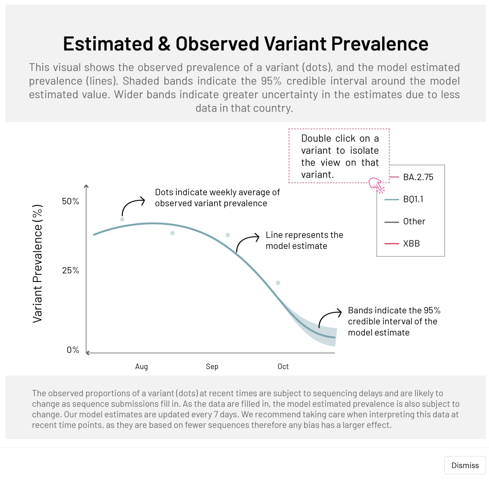
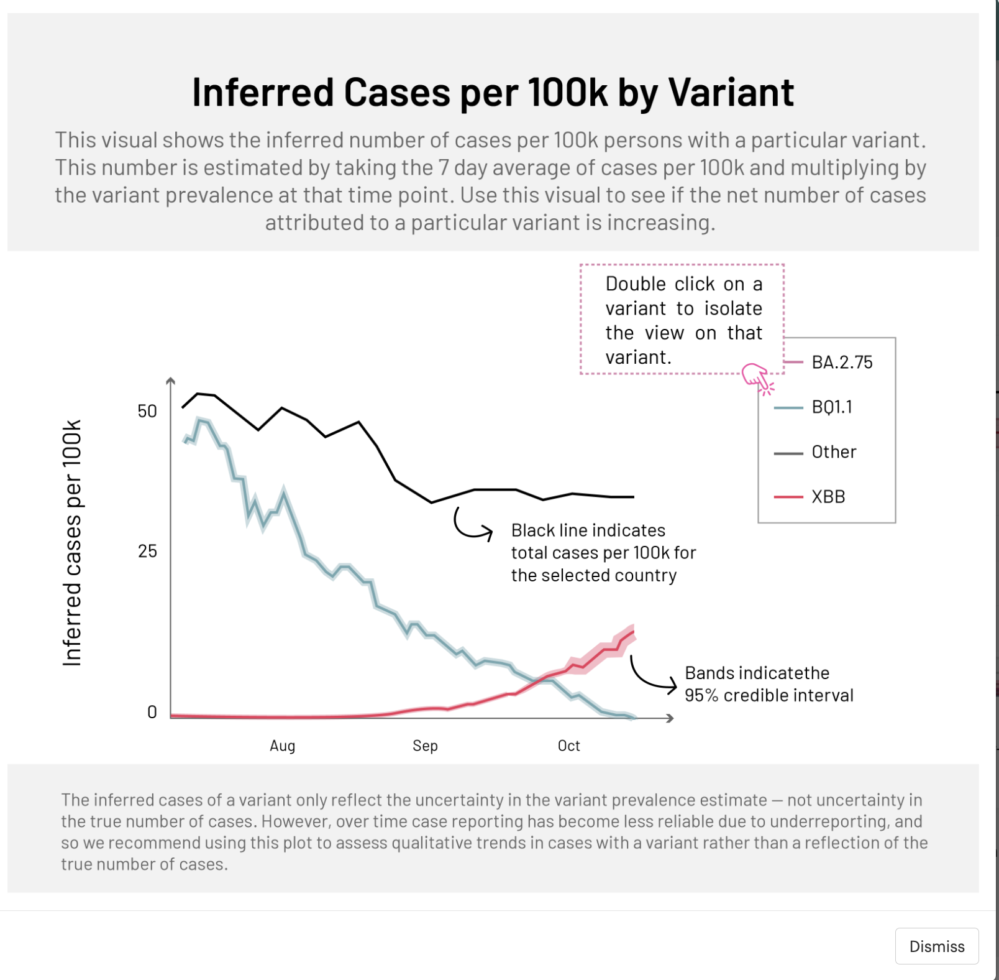
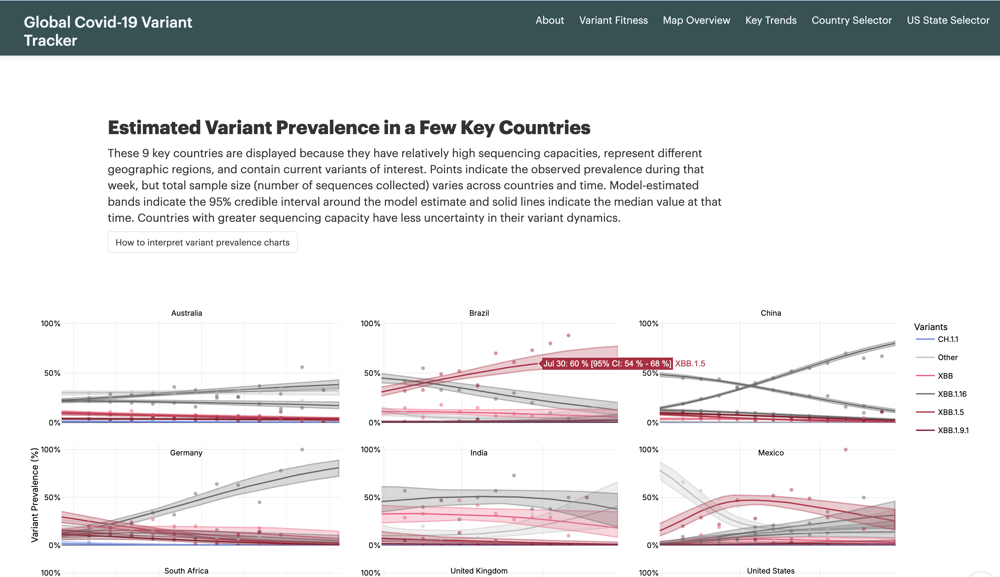

# COVID-19 Variant Dynamics Dashboard - Technical Documentation

## Overview

The **COVID-19 Variant Tracker** is a Shiny web application designed to track SARS-CoV-2 variant dynamics and fitness advantages. It uses genomic sequencing data from the GISAID database combined with a hierarchical statistical model to provide:

- **Variant fitness advantages**: Estimates of how fast each variant is growing relative to a reference variant (currently XBB.1.5)
- **Variant prevalence**: Estimated proportion of each variant over time

- **Inferred cases**: Estimated cases per 100k population by variant

## Purpose

The goal of this dashboard is to:

1. **Provide robust early characterization of the risk posed by novel variants**

2. **Provide real-time variant prevalence estimates to all countries**, even those with limited sequencing capacity

## Data Sources

### Primary Data

- **GISAID EpiCov Database**: SARS-CoV-2 genomic sequences with metadata
  - Pango lineage assignments via Pango Network
  - Collection dates and locations
  - Sequences collected within the past 90 days
  - Updated daily as new sequences are shared via GISAID

### Supporting Data

- **Our World in Data (OWID)**: Country-level COVID-19 case counts
  - Used to infer cases per 100k by variant
  - Integrated with variant prevalence estimates

### Data Processing

- Variant classification via Pango lineage assignments
- Optional updates from covSpectrum for emerging variants (not currently active)
- Temporal filtering: sequences from samples collected within 90 days

## Core Methodology

### Statistical Model

The application uses a **hierarchical Bayesian model** that:

- Shares information across countries and variants
- Models observed Pango lineage counts over time by country
- Estimates fitness advantages (relative growth rates) and prevalence dynamics

#### Key Metrics

1. **Weekly Fitness Advantage** (`advantage`)
   - Percentage growth rate per week relative to the reference variant (XBB.1.5)
   - Positive values = variant is growing faster than reference
   - Negative values = variant is declining relative to reference
   - Reported with 95% credible intervals

2. **Expected Weekly Increase** (`times_r`)
   - Calculated as: `times_r = advantage + 1`
   - Example: `times_r = 2.0` means variant will increase 2× per week relative to XBB.1.5

3. **Variant Prevalence** (`median_prev`)
   - Estimated percentage of infections attributed to each variant
   - Reported as median with 95% credible intervals
   - Estimates account for sequencing lag and uncertainty

4. **Inferred Cases per 100k**
   - Calculated as: `(total cases per 100k) × (variant prevalence)`
   - Only shown when sufficient case data is available

### Model Outputs

The model generates several key outputs:

#### Global Estimates
- **Global fitness advantage**: Average fitness advantage across countries
- **Multi-country distributions**: Posterior distributions from multicountry analysis (`mu_all` table)

#### Country-Specific Estimates
- **Country fitness advantage**: Country-specific relative growth rates
- **Prevalence dynamics**: Time series of variant prevalence with uncertainty bands
- **Observed proportions**: Raw observed proportions from recent sequences (shown as dots)

#### US State-Level Estimates
- Similar outputs at the state level for US states
- Uses US-specific data tables

## Application Features

### 1. Variant Fitness Section

Displays the global estimated fitness advantages of tracked variants:

- **Variant Fitness Chart**: Posterior distributions of weekly fitness advantages
  - X-axis: variants ordered by fitness
  - Y-axis: weekly fitness advantage relative to XBB.1.5 (%)
  - Uncertainty bands: 50%, 70%, 80%, 95%, 99% credible intervals
  
- **Bubble Chart**: Spread vs. fitness visualization
  - X-axis: expected weekly increase relative to XBB.1.5
  - Y-axis: percent change in number of countries reporting the variant
  - Bubble size: number of countries reporting
  - Highlights variants with high growth and geographic spread

- **Key Variants Table**: Summary table showing:
  - Variant name
  - Weekly increase relative to XBB.1.5
  - Weekly fitness advantage (with 95% CI)
  - Number of sequences
  - Number of countries
  - Click rows to view country-level details

### 2. Global Map Overview

Interactive world map showing:
- **Nowcasted prevalence** of a selected variant by country
- Data from countries with sequences collected in the past 90 days
- Color-coded by prevalence percentage
- Hover tooltips with:
  - Country name
  - Date of estimate
  - Estimated prevalence with 95% credible interval

### 3. Key Country Trends

3×3 grid of time series plots showing variant prevalence dynamics for 9 key countries:
- **Countries**: United States, United Kingdom, Germany, Brazil, South Africa, India, China, Mexico, Australia
- **Visualizations**:
  - Solid lines: median estimated prevalence over time
  - Shaded bands: 95% credible intervals
  - Dots: observed proportions from recent sequences
- **Y-axis**: Variant prevalence (0-100%)
- **X-axis**: Time

### 4. Country Selector

Detailed view for any country:

- **Variant Prevalence Chart**: Time series of estimated and observed prevalence
- **Inferred Cases per 100k Chart**: Estimated cases by variant over time (when data sufficient)
- **Variant Characteristics Table**:
  - Current estimated prevalence [95% CI]
  - Observed data from last week
  - Country-specific fitness advantage [95% CI]
  - Global mean fitness advantage [95% CI]

#### Key Insights Displayed
- **Dominant variant**: Which variant has been dominant and for how long
- **Case trends**: Whether new COVID-19 cases are increasing or decreasing over the last 2 weeks

### 5. US State Selector

State-level analysis for US states:

- **State Variant Prevalence Chart**: Similar to country-level prevalence chart
- **State Cases Chart**: Inferred cases per 100k by variant
- **State Variant Characteristics Table**: State-specific fitness advantages and prevalence estimates

## Data Update Schedule

- **Model runs**: Every 7 days
  - Generates fitness advantage estimates
  - Updates prevalence nowcasts
  
- **Sequencing data**: Updated daily
  - New sequences shared via GISAID are incorporated
  - Observed proportions may update more frequently than model estimates

- **Case data**: Updated from OWID as available

## Technical Architecture

### Technologies Used

- **R Shiny**: Web application framework
- **DuckDB**: In-memory database for efficient data querying
- **Plotly**: Interactive visualizations
- **Leaflet**: Interactive mapping
- **sf (Simple Features)**: Spatial data handling
- **DT**: Interactive data tables
- **Statistical modeling**: Hierarchical Bayesian approach (model run external to Shiny app)

## Interpretation Guidelines

### Understanding Fitness Advantage

- **Positive values**: Variant is growing faster than XBB.1.5
- **Negative values**: Variant is declining relative to XBB.1.5
- **Wider intervals**: Greater uncertainty (often from fewer sequences)
- **95% CI includes 0**: Not statistically distinguishable from reference variant

### Understanding Prevalence Estimates

- **Model estimates (lines)**: Smoothed estimates accounting for sampling uncertainty and lag
- **Observed proportions (dots)**: Raw data from sequences, subject to:
  - Lag between collection and GISAID submission
  - Sampling bias
  - Small sample sizes at recent time points
- **Uncertainty bands**: Wider = more uncertainty, often due to:
  - Fewer sequences
  - Recent time periods
  - Countries with limited sequencing capacity

### Limitations and Assumptions

The model makes several simplifying assumptions:

1. **Random sampling**: Assumes sequences are randomly sampled (may not hold due to geographic clustering)
2. **No prioritization**: Assumes no preferential sequencing of certain variants
3. **Constant serial interval**: Assumes same serial interval across variants
4. **Constant fitness**: Assumes fitness advantage constant over 90-day window
5. **Well-mixed population**: Assumes homogeneous mixing (may not hold with subpopulations)
6. **Perfect lineage assignment**: Assumes Pango lineage assignments are correct
7. **Accurate metadata**: Assumes collection dates and locations are correctly reported

**Impact**: Recent estimates may be less reliable due to incomplete data. Estimates for emerging variants may change as more data becomes available.

## Reference Variant

The current reference variant is **XBB.1.5**, selected as the variant with the most sequences in the past two weeks. All fitness advantages are calculated relative to this variant.

## Citation and Acknowledgments

This dashboard uses data from:
- **GISAID Initiative**: SARS-CoV-2 sequences shared by submitting laboratories
- **Our World in Data**: COVID-19 case data from Johns Hopkins CSSE
- **Pango Network**: Lineage classification system

The underlying modeling methodology is described in a preprint available on medRxiv.

## Contact

For questions or issues:
- Email: kjohnson@rockfound.org or zsusswein@rockfound.org

---

**Note**: This documentation describes the technical aspects of the variant tracking dashboard. For operational deployment instructions, see the separate deployment README.